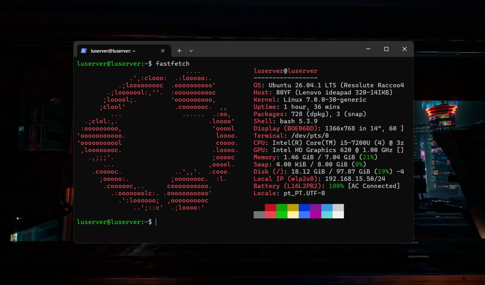
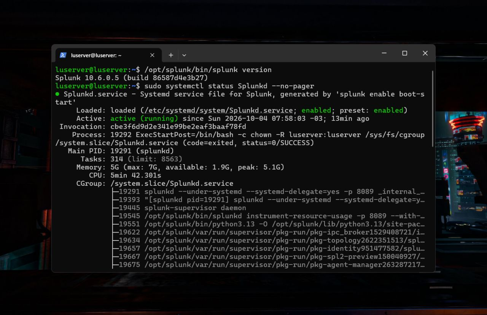
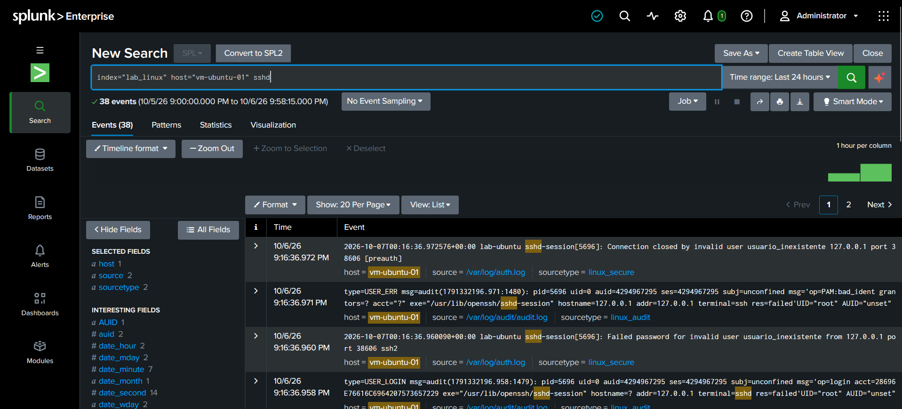

# Splunk SIEM Home Lab

Laboratório pessoal de coleta e análise de logs com Splunk Enterprise, montado em hardware reaproveitado. A ideia é praticar a rotina de um analista SOC: receber logs de um host Linux, pesquisar eventos com SPL, correlacionar fontes diferentes e, mais adiante, criar alertas.

O projeto está em andamento. A seção [Status e próximos passos](#status-e-próximos-passos) mostra o que já foi feito e o que vem a seguir.

## Sumário

- [Arquitetura](#arquitetura)
- [Ambiente](#ambiente)
- [Splunk em execução](#splunk-em-execução)
- [Coleta de logs](#coleta-de-logs)
- [Validação da ingestão](#validação-da-ingestão)
- [Consultas SPL](#consultas-spl)
- [Cenários simulados e detecções](#cenários-simulados-e-detecções)
- [Status e próximos passos](#status-e-próximos-passos)
- [Estrutura do repositório](#estrutura-do-repositório)
- [Diário do lab](#diário-do-lab)

## Arquitetura

Um notebook antigo faz o papel de servidor Splunk. Um segundo host, o `vm-ubuntu-01`, roda Ubuntu Server com auditd e envia seus logs ao Splunk por meio do forwarder.


## Ambiente

### Servidor Splunk

| Item | Detalhe |
| --- | --- |
| Hostname | `luserver` |
| Hardware | Lenovo ideapad 320-14IKB (notebook reaproveitado) |
| CPU | Intel Core i5-7200U, 4 threads |
| Memória | 7 GiB de RAM e 8 GiB de swap |
| Disco | cerca de 98 GiB |
| Sistema operacional | Ubuntu 26.04.1 LTS |
| Kernel | 7.0.0-30-generic |
| Splunk | Splunk Enterprise 10.6.0.5 (build 86587d4e3b27) |
| Serviço | `Splunkd.service`, gerenciado pelo systemd e habilitado no boot |



*Servidor Splunk: Ubuntu Server rodando em um notebook Lenovo ideapad 320.*

### Host monitorado

O `vm-ubuntu-01` é um Ubuntu Server com auditd ativo e o Splunk Forwarder instalado. É a fonte de logs usada nos testes do lab.

## Splunk em execução

A versão instalada e o estado do serviço foram conferidos direto no terminal:

```bash
/opt/splunk/bin/splunk version
sudo systemctl status Splunkd --no-pager
```



*O serviço aparece como `active (running)` e como `enabled`, ou seja, sobe junto com o sistema.*

Um ponto a observar: na hora da captura, o Splunk usava cerca de 5 GB de memória, com pico de 5,1 GB, em um host que tem 7 GiB. Para este lab funciona, mas a folga é pequena, e vale acompanhar esse consumo conforme mais fontes de log forem adicionadas.

## Coleta de logs

O forwarder do `vm-ubuntu-01` envia duas fontes para o índice `lab_linux`:

| Arquivo | Sourcetype | O que traz |
| --- | --- | --- |
| `/var/log/auth.log` | `linux_secure` | Eventos de autenticação e de serviços como o sshd |
| `/var/log/audit/audit.log` | `linux_audit` | Registros do auditd, como `USER_LOGIN` e `USER_ERR` |

## Validação da ingestão

Para confirmar que os logs chegavam ao Splunk, gerei uma tentativa de login SSH com um usuário que não existe (`usuario_inexistente`), feita a partir do próprio host. Depois busquei pelos eventos do `sshd` no índice do lab.



*A busca retornou 38 eventos nas últimas 24 horas, vindos de `auth.log` e de `audit.log`.*

O resultado mais interessante é que a mesma tentativa de login aparece nas duas fontes, e cada uma mostra uma parte da história:

No `auth.log`, o sshd registra `Failed password for invalid user usuario_inexistente`. No `audit.log`, o auditd registra os eventos `USER_LOGIN` e `USER_ERR` com `res=failed`. Os dois trazem o mesmo PID (5696) e o mesmo endereço de origem (127.0.0.1), o que permite ligar um registro ao outro.

É um exemplo simples, mas já ilustra a ideia de correlação entre fontes que pretendo praticar nas próximas etapas.

## Consultas SPL

Consulta usada na validação:

```text
index="lab_linux" host="vm-ubuntu-01" sshd
```

Ela filtra o índice do lab, o host monitorado e a palavra `sshd`. Foi suficiente para confirmar a ingestão.

Consultas que pretendo executar a seguir, ainda não testadas:

```text
index="lab_linux" | stats count by source, sourcetype
```

```text
index="lab_linux" "Failed password" | stats count by host
```

A primeira confere quantos eventos chegam por fonte. A segunda conta tentativas de senha incorreta por host. Cada consulta nova que eu usar de verdade será adicionada aqui, junto com uma captura de tela.

## Cenários simulados e detecções

Esta seção cresce conforme o lab evolui. Todos os eventos são gerados em máquinas próprias, apenas para estudo.

### Cenários simulados

| Cenário | Fonte de log | MITRE ATT&CK | Status | Evidência |
| --- | --- | --- | --- | --- |
| Falha de autenticação SSH com usuário inexistente | `auth.log` e `audit.log` | A mapear | Executado | [Captura](screenshots/ingestion/01-busca-sshd-vm-ubuntu-01.png) |

As capturas de cada novo cenário ficam em `screenshots/attacks/`.

### Detecções e alertas

| Alerta | Consulta SPL | Fonte | Status |
| --- | --- | --- | --- |
| Nenhum alerta criado ainda | | | Planejado |

Cada alerta criado ganha uma linha nesta tabela, com a consulta, o limite usado e uma captura em `screenshots/detections/`.

## Status e próximos passos

Concluído:

- [x] Splunk Enterprise instalado e rodando como serviço no `luserver`
- [x] Host `vm-ubuntu-01` com Ubuntu Server e auditd
- [x] Forwarder instalado e enviando `auth.log` e `audit.log` para o índice `lab_linux`
- [x] Primeira busca validando a ingestão dos logs

Próximos passos:

- [ ] Praticar comandos SPL para visualizar e filtrar os dados
- [ ] Estudar correlação de logs e de fontes
- [ ] Gerar mais eventos no host, como falhas de login e uso de sudo, e acompanhar no Splunk
- [ ] Criar regras de alerta simples e documentá-las neste README
- [ ] Padronizar o nome do host, que aparece como `lab-ubuntu` dentro dos logs e como `vm-ubuntu-01` no Splunk

Ideias para avaliar mais adiante, sem prazo definido:

- [ ] Dashboard simples com falhas de autenticação
- [ ] Adicionar outra fonte de log ao lab
- [ ] Mapear os cenários simulados para técnicas do MITRE ATT&CK

## Estrutura do repositório

```text
splunk-siem-home-lab/
├── README.md
└── screenshots/
    ├── infrastructure/   servidor, serviço e configuração
    ├── ingestion/        coleta e validação dos logs
    ├── attacks/          cenários simulados
    └── detections/       alertas e dashboards
```

## Diário do lab

| Data | Atualização |
| --- | --- |
| 2026-10-04 | Splunk Enterprise 10.6.0.5 em execução como serviço no `luserver`. |
| 2026-10-06 | Logs do `vm-ubuntu-01` chegando ao Splunk via forwarder. Ingestão validada com um login SSH inválido de teste. |
